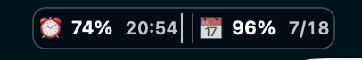

# Codex Usage Menu Bar

A lightweight native macOS menu bar app that shows your remaining Codex usage and reset times without opening the Codex window.


*Always visible beside the notch while you work.*



*Remaining short-window usage and reset time on the left; weekly usage and reset date on the right.*

```text
⏰17% 14:32 ║ 📅87% 7/18
```

- `⏰` shows the rolling short-window limit and its reset time.
- `📅` shows the weekly limit and its reset date.
- Refreshes automatically every 30 seconds.
- Keeps working when the Codex window is closed.
- Uses the local Codex app-server and your existing login session.
- Never reads, copies, or stores your authentication token.

## Requirements

- macOS 13 Ventura or later.
- Codex for macOS or ChatGPT for macOS with Codex installed and signed in.
- Xcode Command Line Tools when installing from source: `xcode-select --install`.

Both Apple Silicon and Intel Macs are supported when built from source. Release ZIPs are Universal binaries.

## Install

### Build from source

```bash
git clone https://github.com/rorschachwilpeng/codex-usage-menubar.git
cd codex-usage-menubar
./scripts/install.sh
```

The installer builds the app for your Mac, copies it to `~/Applications/Codex Usage.app`, and adds a user LaunchAgent so it starts at login.

### Download a release

Download `Codex-Usage-v*.app.zip` from [Releases](https://github.com/rorschachwilpeng/codex-usage-menubar/releases), unzip it, and move the app to `~/Applications`.

Release builds are ad-hoc signed, not Apple-notarized. If macOS blocks the first launch, open **System Settings → Privacy & Security** and choose **Open Anyway**. Building from source avoids downloading an untrusted executable.

## Usage

The app finds Codex in these locations, in order:

1. The executable specified by `CODEX_EXECUTABLE`.
2. ChatGPT or Codex in `/Applications`.
3. ChatGPT or Codex in `~/Applications`.
4. A `codex` executable available on `PATH`.

The display follows your Mac's current time zone. On a MacBook with a notch, the pill stays inside the left safe area. On non-notch displays, macOS manages it as a standard status item.

## Privacy

The app launches Codex's bundled local app-server and calls the read-only `account/rateLimits/read` method. It stores only the last successful percentages, reset timestamps, and update timestamp in:

```text
~/Library/Application Support/CodexUsageMenuBar/last-usage.json
```

See [PRIVACY.md](PRIVACY.md) for the complete data statement.

## Troubleshooting

### "Codex executable not found"

Install ChatGPT/Codex in `/Applications`, or launch with an explicit path:

```bash
CODEX_EXECUTABLE="/custom/path/to/codex" "$HOME/Applications/Codex Usage.app/Contents/MacOS/CodexUsageMenuBar"
```

### No usage data appears

Open ChatGPT/Codex once and confirm that you are signed in. Then choose **Refresh Now** from the menu bar item or restart the app.

### The app stopped after a Codex update

Codex's local app-server interface may change. Check [Issues](https://github.com/rorschachwilpeng/codex-usage-menubar/issues) for compatibility reports and include your macOS and Codex versions when filing a new one.

## Development

```bash
./scripts/test.sh
./scripts/test.sh --smoke  # Uses your real local Codex session
./scripts/build-app.sh
./scripts/verify-app.sh "build/Codex Usage.app"
```

Set `CODEX_BUILD_UNIVERSAL=1` when full Xcode is installed to build a Universal app:

```bash
CODEX_BUILD_UNIVERSAL=1 ./scripts/build-app.sh
```

## Uninstall

```bash
./scripts/uninstall.sh
```

## Compatibility note

This project uses an undocumented local Codex app-server method. It can break when Codex changes its bundled protocol. The app retains the last successful value and fails without accessing credentials, but compatibility is not guaranteed across future Codex releases.

## License

[MIT](LICENSE)
